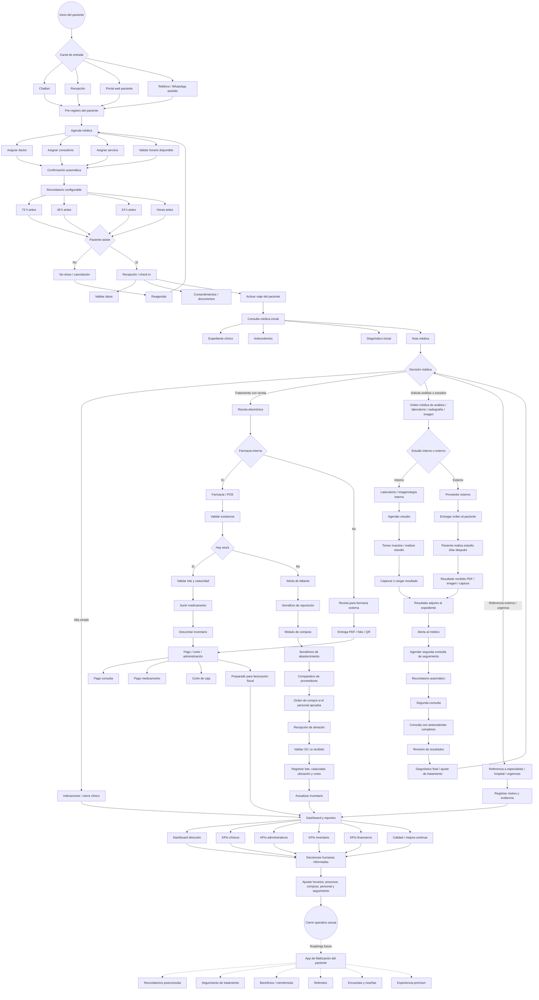
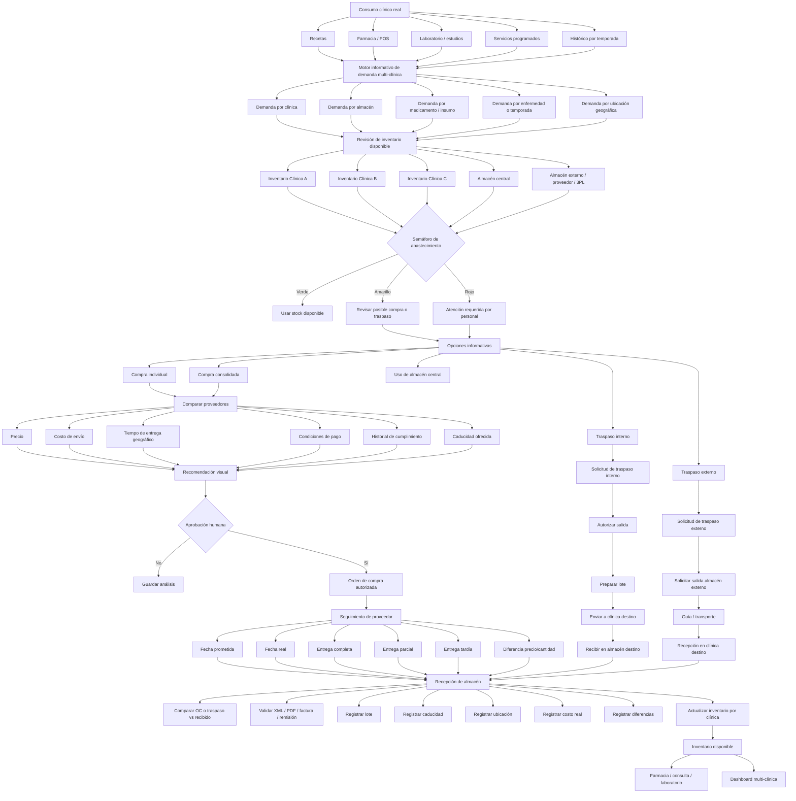
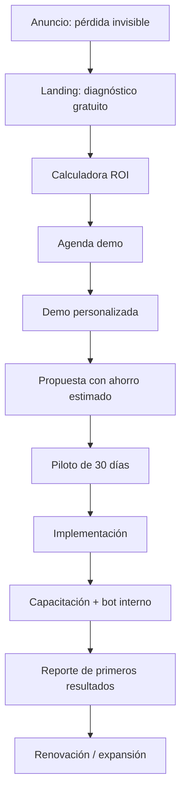

# INTEGRIKA — Documento maestro del chat

**Proyecto:** SaaS médico 360° para clínicas, consultorios y hospitales pequeños/medianos  
**Objetivo del documento:** Consolidar en un solo archivo Markdown todo lo trabajado en el chat: posicionamiento, investigación, fricciones del mercado, módulos, flujos, guiones, pitch, enfoque de marketing, video y roadmap.  
**Estado:** Documento de trabajo para marketing, ventas, pitch, desarrollo de producto y producción audiovisual.

---

## 1. Resumen ejecutivo

El proyecto consiste en una plataforma médica 360° para clínicas, consultorios y hospitales que buscan operar con más control, trazabilidad, eficiencia y calidad de atención.

La propuesta no debe venderse como “otro software médico” ni como una lista de módulos. El enfoque correcto es atacar las pérdidas invisibles que ocurren cuando la operación clínica está desconectada:

- citas no confirmadas;
- pacientes esperando sin trazabilidad;
- recepción saturada;
- datos capturados varias veces;
- expedientes incompletos;
- recetas desconectadas de farmacia;
- inventario que no cuadra;
- medicamentos caducados;
- compras urgentes;
- proveedores con entregas tardías o parciales;
- pagos no conciliados;
- reportes administrativos tardíos;
- falta de dashboard para decidir;
- riesgo documental, legal, operativo y reputacional.

La tesis comercial central es:

> **Una clínica no pierde dinero solo por falta de pacientes. También pierde dinero por procesos desconectados.**

La frase de posicionamiento más fuerte es:

> **De la cita al cobro. Del análisis al seguimiento. De la receta al inventario. De la compra a la recepción de almacén. Del proveedor al control financiero.**

El sistema no compra, no autoriza y no toma decisiones por el personal. El sistema informa, mide, alerta, compara y muestra semáforos visuales para facilitar la decisión humana.

---

## 2. Posicionamiento recomendado

### 2.1. Posicionamiento principal

> **Control operativo 360° para clínicas, consultorios y hospitales que quieren crecer sin perder control.**

### 2.2. Posicionamiento financiero

> **Invierte una parte de lo que hoy pierdes en recuperar control.**

### 2.3. Posicionamiento premium

> **Una clínica premium no solo se ve bien: mide, controla, documenta y mejora cada etapa de la experiencia del paciente.**

### 2.4. Posicionamiento internacional

> **A healthcare operations platform for clinics that need traceability from appointment to payment, from prescription to inventory, and from procurement to financial control.**

---

## 3. Qué NO debe prometerse

Para evitar promesas riesgosas, el marketing debe cuidar el lenguaje.

### No decir

- “El sistema compra automáticamente.”
- “El sistema toma decisiones por la clínica.”
- “Cumple automáticamente con todas las regulaciones.”
- “Elimina por completo errores.”
- “Elimina por completo robo hormiga.”
- “Garantiza certificación.”
- “Sustituye al contador, abogado o responsable sanitario.”
- “Stripe equivale a facturación fiscal mexicana.”

### Sí decir

- “El sistema informa, alerta, compara y muestra semáforos para apoyar decisiones del personal.”
- “Diseñado para operar con trazabilidad, control de acceso y evidencia documental.”
- “Ayuda a reducir fricción, errores operativos y pérdidas invisibles.”
- “Ayuda a generar indicadores y evidencia para procesos de calidad, auditoría y mejora continua.”
- “Pagos y administración conectados; preparado para integrarse con facturación fiscal según alcance.”

---

## 4. Dolor central del mercado

El mercado objetivo no compra por entusiasmo tecnológico. Compra cuando entiende que el desorden operativo cuesta dinero, tiempo, riesgo y reputación.

La narrativa debe hacer que el dueño, administrador o médico propietario diga:

> “Sí, eso me pasa a mí.”

Después se presenta la solución puntual.

---

## 5. Fricciones principales detectadas

### 5.1. Agenda y recepción

**Dolores:**

- citas no confirmadas;
- llamadas perdidas;
- pacientes que no llegan;
- recepción saturada;
- datos capturados varias veces;
- horarios muertos;
- mala primera impresión.

**Solución ya contemplada:**

- chatbot;
- agenda digital;
- confirmación automática;
- recordatorios;
- asignación de doctor, consultorio y servicio;
- estado de cita visible.

**Qué evita:**

- no-shows;
- doble captura;
- citas duplicadas;
- huecos en agenda;
- mala experiencia inicial.

**Indicadores:**

- citas confirmadas;
- citas canceladas;
- no-shows;
- ocupación por doctor;
- ocupación por consultorio;
- tiempo de registro.

---

### 5.2. Viaje del paciente invisible

**Dolores:**

- paciente esperando sin seguimiento;
- doctor sin saber si el paciente ya llegó;
- caja sin saber qué cobrar;
- administración sin tiempos reales;
- paciente percibe desorden.

**Solución ya contemplada:**

- check-in;
- ruta del paciente;
- etapas visibles;
- recepción, consulta, receta, farmacia, pago y seguimiento;
- trazabilidad por responsable.

**Qué evita:**

- pacientes perdidos dentro del proceso;
- esperas sin explicación;
- falta de coordinación;
- quejas por desorden.

**Indicadores:**

- tiempo de check-in;
- tiempo de espera;
- tiempo de consulta;
- tiempo hasta pago;
- tiempo total de ciclo del paciente.

---

### 5.3. Expediente clínico y riesgo documental

**Dolores:**

- expediente incompleto;
- notas dispersas;
- recetas en papel;
- estudios en WhatsApp o carpetas;
- falta de trazabilidad;
- riesgo médico-administrativo.

**Solución ya contemplada:**

- expediente clínico digital;
- antecedentes;
- diagnóstico;
- nota médica;
- receta electrónica;
- adjuntos;
- bitácora;
- control de acceso por roles.

**Qué evita:**

- información perdida;
- duplicidad;
- dependencia de papel;
- falta de evidencia;
- exposición innecesaria de datos.

---

### 5.4. Privacidad y datos sensibles

**Dolores:**

- datos médicos dispersos;
- información sensible en chats, hojas o carpetas;
- usuarios con acceso excesivo;
- falta de evidencia de quién consultó o modificó;
- riesgo reputacional.

**Solución ya contemplada:**

- acceso por roles;
- separación por clínica;
- auditoría;
- bitácoras;
- documentos ligados al expediente;
- operación multi-clínica.

**Mensaje correcto:**

> **Diseñado para ayudar a operar con control de acceso, trazabilidad y evidencia documental.**

---

### 5.5. Receta desconectada de farmacia

**Dolores:**

- doctor receta, pero farmacia no sabe si hay existencia;
- receta en papel;
- POS separado;
- inventario desactualizado;
- salidas sin trazabilidad;
- medicamentos regulados sin política clara.

**Solución ya contemplada:**

- receta electrónica;
- folio o QR;
- farmacia consulta receta;
- POS conectado;
- validación de existencia;
- lote y caducidad;
- surtido por receta;
- descuento automático de inventario;
- reglas para medicamentos controlados o con receta.

**Mensaje comercial:**

> **La receta no debe morir en papel. Debe conectar decisión médica, farmacia, inventario y administración.**

---

### 5.6. Inventario, caducidades y robo hormiga

**Dolores:**

- inventario que no cuadra;
- stock fantasma;
- faltantes sin explicación;
- medicamentos caducados;
- compras urgentes;
- salidas sin responsable;
- robo hormiga difícil de probar.

**Solución ya contemplada:**

- inventario por clínica y almacén;
- lotes;
- caducidades;
- ubicaciones;
- PEPS/FEFO;
- mínimos y máximos;
- alertas;
- salidas por receta, venta, consumo o traspaso;
- bitácora.

**Qué evita:**

- merma invisible;
- caducidades no detectadas;
- faltantes recurrentes;
- compras innecesarias;
- inventario inflado o falso.

---

### 5.7. Estudios, análisis, laboratorio, radiografía y seguimiento

Esta variante es crítica porque muchas consultas no terminan en receta inmediata. Terminan en una orden de estudios y una segunda consulta.

**Dolores:**

- médico solicita análisis, laboratorio o radiografía;
- paciente se hace el estudio días después;
- resultado llega por WhatsApp, PDF, papel o imagen;
- no siempre se adjunta al expediente;
- paciente no siempre agenda segunda consulta;
- se pierde continuidad clínica y oportunidad económica.

**Solución contemplada:**

- orden médica de análisis, laboratorio, radiografía o imagenología;
- estudio interno o externo;
- resultado adjunto al expediente;
- alerta al médico;
- segunda consulta de seguimiento;
- recordatorios automáticos;
- consulta con antecedentes completos.

**Mensaje comercial:**

> **El sistema no solo controla la primera consulta. Controla el seguimiento médico hasta cerrar el caso del paciente.**

---

### 5.8. Compras y proveedores

El módulo de compras no debe ser una simple orden de compra. Debe conectar necesidad clínica, inventario, proveedor, compra, recepción de almacén, costo real y disponibilidad.

**Dolores:**

- compras por urgencia;
- proveedor entrega tarde;
- proveedor entrega parcial;
- precio distinto al cotizado;
- factura/XML/PDF no se compara con recepción;
- producto entra sin lote, caducidad o ubicación;
- no se mide si el proveedor conviene;
- no se consideran clima, temporadas o enfermedades frecuentes.

**Solución contemplada:**

- detección de necesidad;
- alertas de stock bajo;
- semáforos;
- análisis de consumo histórico;
- análisis de temporadas, clima y enfermedades frecuentes;
- análisis de citas futuras y servicios programados;
- solicitud de cotización por correo;
- comparación de proveedores;
- orden de compra;
- seguimiento de fecha prometida vs fecha real;
- recepción de almacén ligada a OC;
- comparación de OC vs recibido;
- lote, caducidad, ubicación, costo real;
- score de proveedor.

**Importante:**

El sistema no compra. El sistema informa y alerta. La decisión y aprobación la toma el personal autorizado.

---

### 5.9. Compras consolidadas e inventario multi-clínica

Cuando existen varias clínicas o sucursales, el sistema debe soportar una vista multi-clínica.

**Elementos contemplados:**

- inventario separado por clínica;
- inventario por almacén;
- almacén central;
- almacén externo;
- vista corporativa;
- compras consolidadas;
- traspasos internos;
- traspasos externos;
- tiempos de entrega por ubicación geográfica;
- costos de envío;
- proveedor recomendado por zona;
- abastecimiento con base en demanda, clima, temporada y consumo.

**Mensaje comercial:**

> **No solo controlamos qué medicamento hay. Controlamos dónde está, por qué se necesita, si conviene comprarlo, traspasarlo o consolidarlo, cuándo debe llegar, cuánto cuesta realmente y qué proveedor conviene según la ubicación de cada clínica.**

---

### 5.10. Dashboard y toma de decisiones

**Dolores:**

- dirección decide tarde;
- reportes manuales;
- información dispersa;
- no se miden tiempos;
- no se detectan cuellos de botella;
- no se sabe margen real por servicio o medicamento.

**Solución contemplada:**

- dashboard directivo;
- KPIs clínicos;
- KPIs administrativos;
- KPIs financieros;
- KPIs de inventario;
- KPIs de compras;
- KPIs de proveedor;
- KPIs de seguimiento;
- semáforos visuales.

**Mensaje:**

> **Lo que no se mide no se corrige. El dashboard convierte la operación diaria en decisiones.**

---

### 5.11. Calidad, reputación premium y certificaciones

**Dolores:**

- buena imagen, pero procesos desordenados;
- pacientes insatisfechos por espera;
- falta de indicadores;
- falta de evidencia para auditoría;
- deseo de certificarse sin procesos medidos;
- falta de trazabilidad documental.

**Solución contemplada:**

- trazabilidad por etapa;
- expediente;
- receta electrónica;
- control de medicamentos;
- dashboard;
- indicadores;
- bitácoras;
- evidencias por proceso;
- mejora continua.

**Mensaje prudente:**

> **El software no certifica por sí solo, pero ayuda a generar evidencia, indicadores, trazabilidad y control documental para procesos de calidad, auditoría y mejora continua.**

---

## 6. Investigación y fuentes internacionales de referencia

El análisis trabajó con el criterio de que las fricciones médicas no son solo mexicanas. Son globales. Lo que cambia es la regulación de cada país; lo que se repite es la desconexión operativa.

### Revistas y fuentes relevantes

#### Salud digital e informática médica

- The Lancet Digital Health
- JAMA Network Open
- NEJM Catalyst
- BMJ Quality & Safety
- npj Digital Medicine
- Journal of Medical Internet Research — JMIR
- Journal of the American Medical Informatics Association — JAMIA
- International Journal of Medical Informatics
- BMC Medical Informatics and Decision Making
- BMJ Health & Care Informatics

#### Servicios de salud, gestión y política sanitaria

- Health Affairs
- BMC Health Services Research
- Health Services Management Research
- International Journal for Quality in Health Care
- Journal for Healthcare Quality
- Medical Care
- Medical Care Research and Review
- BMC Medicine

#### Farmacia, prescripción e inventario

- British Journal of Clinical Pharmacology
- International Journal of Pharmacy Practice
- Journal of Pharmacy Practice and Research
- literatura de pharmaceutical supply chain, inventory, stockouts, traceability, medication safety.

### Fricciones internacionales coincidentes

- no-shows;
- dificultad de acceso y agenda;
- esperas y flujo del paciente;
- carga administrativa del médico;
- expediente clínico y documentación;
- privacidad y seguridad;
- errores de prescripción;
- receta desconectada de farmacia;
- inventario opaco;
- caducidades;
- stockouts;
- compras sin trazabilidad;
- administración sin datos;
- calidad y certificación;
- experiencia del paciente.

---

## 7. Mapa general de módulos

```text
SaaS médico 360°
├── Captación / chatbot
├── Agenda médica
├── Confirmaciones y recordatorios
├── Recepción / check-in
├── Viaje del paciente
├── Expediente clínico
├── Consulta médica
├── Receta electrónica
├── Estudios / laboratorio / radiografía / imagenología
├── Seguimiento y segunda consulta
├── Farmacia / POS
├── Inventario por clínica y almacén
├── Compras y proveedores
├── Compras consolidadas
├── Traspasos internos y externos
├── Recepción de almacén
├── Pagos y cortes
├── Facturación / integración fiscal futura
├── Dashboard directivo
├── Bot interno de ayuda al personal
├── Calidad, indicadores y auditoría
└── Roadmap: app de fidelización del paciente
```

---

## 8. Diagrama maestro de flujo operativo



---

## 9. Diagrama de compras, almacén, consolidación y traspasos



---

## 10. Semáforos visuales

El sistema debe usar semáforos para facilitar lectura operativa.

### Semáforos sugeridos

| Color | Significado | Acción humana esperada |
|---|---|---|
| Verde | Operación normal | Continuar |
| Amarillo | Atención preventiva | Revisar, programar, validar |
| Rojo | Riesgo o acción requerida | Personal debe atender |
| Gris | Información pendiente | Completar dato |
| Azul | En proceso / seguimiento | Monitorear |

### Ejemplos de semáforos

- stock bajo;
- producto agotado;
- medicamento próximo a caducar;
- proveedor retrasado;
- entrega parcial;
- precio diferente;
- factura pendiente;
- estudio sin resultado;
- paciente sin seguimiento;
- segunda consulta no agendada;
- expediente incompleto;
- pago pendiente;
- corte pendiente;
- compra pendiente de aprobación.

---

## 11. ROI y cálculo de retorno

La venta debe comparar la inversión del software contra las pérdidas actuales, no contra otro gasto mensual.

### Fórmula base

```text
Ahorro / recuperación mensual =
(citas recuperadas x ticket promedio)
+ ahorro de horas administrativas
+ reducción de merma de inventario
+ reducción de errores/capturas duplicadas
+ mejor cobranza / conciliación
- costo mensual del software
```

### Pérdida mensual estimada

```text
Pérdida mensual estimada =
citas perdidas
+ horas administrativas desperdiciadas
+ medicamentos caducados
+ diferencias de inventario
+ compras urgentes
+ servicios no cobrados
+ tiempo de cierre administrativo
+ costo por errores operativos
```

### Ejemplo conservador

Supuestos:

- 300 citas al mes.
- Ticket promedio: $900 MXN.
- No-show: 10%.
- Recuperación conservadora: 20% de no-shows.
- Inventario promedio: $200,000 MXN.
- Merma/caducidad/diferencias: 2% mensual.
- Reducción conservadora: 25% de esa pérdida.
- Ahorro administrativo: 30 horas mensuales.
- Hora administrativa: $80 MXN.

| Concepto | Estimación |
|---|---:|
| Citas no-show actuales | 30 |
| Citas recuperadas conservadoras | 6 |
| Ingreso recuperado | $5,400 |
| Merma inventario actual | $4,000 |
| Merma evitada conservadora | $1,000 |
| Ahorro administrativo | $2,400 |
| Valor mensual recuperable | **$8,800** |

Mensaje para ventas:

> **No es caro. Caro es seguir perdiendo sin medirlo.**

### Retorno probable por tipo de cliente

| Tipo de cliente | Dónde está el ROI | Retorno probable |
|---|---|---|
| Consultorio individual | Agenda, pagos, expediente, recordatorios | 4 a 9 meses |
| Clínica pequeña sin farmacia | Agenda, recepción, cobros, expediente, seguimiento | 3 a 6 meses |
| Clínica con farmacia | Inventario, receta, POS, caducidad, compras, cobros | 2 a 5 meses |
| Hospital pequeño | Trazabilidad, compras, almacén, caja, farmacia, reportes | 3 a 9 meses |
| Red de clínicas | Estandarización, multi-sucursal, reportes, control corporativo | 2 a 6 meses |

**Nota:** Son estimaciones comerciales. Deben calcularse con datos reales de cada clínica y no prometerse como garantía.

---

## 12. Funnel de marketing y ventas



### Oferta de entrada recomendada

> **Diagnóstico gratuito de fugas operativas en clínicas.**

Incluye revisión de:

- agenda;
- no-shows;
- recepción;
- expediente;
- estudios y seguimiento;
- farmacia;
- inventario;
- compras;
- proveedores;
- pagos;
- reportes;
- privacidad y trazabilidad.

CTA recomendado:

> **Descubre cuánto dinero pierde tu clínica por procesos desconectados.**

---

## 13. Segmentos y mensajes por comprador

| Persona | Lo que le duele | Mensaje |
|---|---|---|
| Dueño de clínica | Fugas, baja rentabilidad, descontrol | “Recupera visibilidad y mide dónde se pierde dinero.” |
| Administrador | Procesos manuales, reportes tarde | “Opera con trazabilidad y menos retrabajo.” |
| Médico propietario | Carga documental, mala continuidad | “Atiende con contexto completo y seguimiento ordenado.” |
| Farmacia / almacén | Stock falso, caducidades, faltantes | “Cada medicamento tiene entrada, lote, ubicación y salida.” |
| Contador / finanzas | Ingresos no conciliados | “Cobros, POS, compras e inventario conectados.” |
| Jurídico / cumplimiento | Datos sensibles y evidencia | “Control de acceso, bitácoras y trazabilidad documental.” |
| Recepción | Saturación y errores | “Flujo guiado, menos capturas repetidas y mejor experiencia.” |

---

## 14. Objeciones y respuestas

| Objeción | Respuesta recomendada |
|---|---|
| “Ya tengo agenda” | Agenda sola no conecta receta, farmacia, inventario, pagos, compras y dirección. |
| “Mi clínica ya se ve premium” | La experiencia premium también depende de tiempos, trazabilidad y seguimiento. |
| “No quiero complicar al personal” | El bot interno guía paso a paso y reduce dependencia de capacitación manual. |
| “Es otra inversión” | Primero calculemos cuánto se pierde hoy por citas, inventario, tiempo y errores. |
| “No necesito certificación” | No se trata solo de certificarse; se trata de operar con evidencia, indicadores y control. |
| “Mi contador ve eso” | El contador ve lo que ya ocurrió. El dashboard ayuda a corregir mientras ocurre. |
| “Farmacia ya tiene control” | Si farmacia no está conectada a receta, POS, compras e inventario, el control es parcial. |
| “Excel me funciona” | Excel registra tarde. El problema es operar en tiempo real. |
| “Mi clínica es pequeña” | Justamente por eso no puedes permitir fugas invisibles. |

---

## 15. Landing page propuesta

### Hero

**Tu clínica puede estar perdiendo dinero por procesos desconectados**

Agenda, recepción, expediente, receta, estudios, seguimiento, farmacia, inventario, pagos, compras, proveedores y administración en una sola plataforma médica 360°.

**CTA principal:** Agenda un diagnóstico operativo  
**CTA secundario:** Calcular pérdidas invisibles

---

### Bloque de identificación

**¿Esto pasa en tu clínica?**

- Citas no confirmadas.
- Pacientes esperando sin trazabilidad.
- Datos capturados dos veces.
- Expedientes incompletos.
- Resultados de laboratorio dispersos.
- Pacientes que no regresan a seguimiento.
- Recetas desconectadas de farmacia.
- Inventario que no cuadra.
- Medicamentos caducados.
- Compras urgentes.
- Proveedores retrasados.
- Cobros no conciliados.
- Reportes administrativos tardíos.
- Personal nuevo cometiendo errores.
- Decisiones tomadas sin dashboard.

---

### Bloque de solución

**Ya no operes por partes. Conecta el ciclo completo.**

```text
Chatbot → Agenda → Recepción → Consulta → Estudios → Seguimiento → Receta → Farmacia → Inventario → Pago → Compras → Proveedores → Dashboard
```

---

### Bloque premium

**Para clínicas que quieren operar con estándares más altos**

- mejor experiencia del paciente;
- menos tiempo de espera;
- trazabilidad por etapa;
- evidencia documental;
- indicadores de desempeño;
- control de medicamentos;
- alertas operativas;
- semáforos visuales;
- soporte interno al personal;
- datos para auditoría y mejora continua.

---

### Bloque ROI

**La inversión debe compararse contra lo que hoy se pierde**

Calculamos contigo:

- citas recuperables;
- horas administrativas ahorrables;
- merma de inventario;
- caducidades evitables;
- diferencias de almacén;
- servicios no cobrados;
- tiempo de cierre administrativo;
- errores operativos recurrentes;
- compras urgentes;
- traspasos mal documentados.

---

## 16. Guion principal para video marketing

Duración aproximada trabajada: 2:59 minutos, según voz de ElevenLabs subida.

```text
¿Te pasa que tu clínica atiende pacientes todos los días,
pero aun así hay citas que no se confirman,
pacientes esperando sin trazabilidad,
datos capturados dos veces,
recetas desconectadas de farmacia,
inventario que no siempre cuadra,
medicamentos que caducan,
compras urgentes,
proveedores que no entregan a tiempo
y reportes administrativos que llegan tarde?

Ese desorden no solo consume tiempo.
También cuesta dinero, aumenta riesgos y afecta la experiencia del paciente.

Por eso desarrollamos una plataforma médica trescientos sesenta,
para clínicas, consultorios y hospitales que quieren operar con más control
y ofrecer una atención más premium.

El paciente agenda desde un chatbot.
La cita se conecta con doctor, consultorio y servicio.
Recepción valida datos y activa el viaje del paciente.
El médico trabaja con expediente clínico, antecedentes, diagnóstico y receta electrónica.

Si el paciente necesita análisis, laboratorio, radiografía o estudios externos,
el sistema registra la orden,
la conecta al expediente
y permite dar seguimiento hasta la segunda consulta.

Cuando el resultado está disponible,
se adjunta al expediente,
se alerta al médico
y se agenda seguimiento con recordatorios automáticos.

Así la segunda consulta no empieza desde cero.
El médico ya tiene antecedentes, resultados, diagnóstico previo y evolución del caso.

En farmacia, el sistema muestra existencia, lote, caducidad y disponibilidad.
El inventario se actualiza con cada entrada, salida, receta o venta.

En compras, el sistema no decide ni compra automáticamente.
Informa al personal con semáforos visuales:
stock bajo,
producto próximo a caducar,
proveedor retrasado,
precio diferente,
entrega parcial
o posible necesidad de reposición.

También permite comparar proveedores, tiempos de entrega, costos de envío,
condiciones de pago, ubicación geográfica y disponibilidad.

Si existen varias clínicas,
cada una mantiene su inventario separado,
pero dirección puede ver el inventario consolidado,
detectar excedentes,
solicitar traspasos entre almacenes
y analizar compras consolidadas con mejor información.

Cada etapa deja evidencia.
Cada medicamento tiene trazabilidad.
Cada estudio queda ligado al expediente.
Cada compra se relaciona con una recepción de almacén.
Y cada decisión puede apoyarse en un tablero de control.

Así reduces errores,
mejoras tiempos de atención,
detectas cuellos de botella,
controlas mínimos y caducidades,
capacitas mejor al personal
y tomas decisiones clínicas, operativas y administrativas con datos reales.

No es solo agenda.
No es solo expediente.
No es solo farmacia.

Es control operativo trescientos sesenta
para clínicas que quieren crecer,
mejorar su servicio,
trabajar con estándares más altos
y ofrecer una experiencia más premium al paciente.

De la cita al cobro.
Del análisis al seguimiento.
De la receta al inventario.
De la compra a la recepción de almacén.
Del proveedor al control financiero.

Agenda un diagnóstico
y descubre cuánto puede estar perdiendo tu clínica
por procesos desconectados.
```

---

## 17. Guion corto para anuncio 30–40 segundos

```text
Tu clínica puede verse premium,
pero si la agenda, recepción, expediente, farmacia, inventario, compras y administración están desconectadas,
sigues perdiendo tiempo, dinero y control.

Citas no confirmadas.
Pacientes esperando.
Recetas desconectadas.
Inventario que no cuadra.
Medicamentos que caducan.
Proveedores retrasados.
Reportes tarde.

Nuestra plataforma médica trescientos sesenta conecta todo el flujo:
chatbot, agenda, recepción, consulta, estudios, seguimiento, receta, farmacia, inventario, compras, pagos y tablero de control.

El sistema no decide por tu equipo.
Informa, mide y muestra semáforos para que el personal actúe a tiempo.

Menos fricción.
Más trazabilidad.
Mejores tiempos.
Mejor experiencia para el paciente.

Agenda un diagnóstico y recupera el control de tu clínica.
```

---

## 18. Prompt para ElevenLabs

```text
Voz femenina adulta, español latinoamericano neutro con ligera calidez mexicana.
Tono profesional, confiable, claro y premium.
No sonar como locutora exagerada ni como anuncio agresivo.
Debe sonar como una asesora ejecutiva explicando una solución seria para dueños de clínicas, hospitales y consultorios.
Ritmo medio, pausas naturales, énfasis en los dolores operativos y en las soluciones.
Transmitir seguridad, control, orden y modernidad.
```

### Configuración sugerida

```text
Modelo: Eleven Multilingual v2 o Eleven v3
Estilo: profesional, claro, confiable
Velocidad: 0.94 a 0.98
Estabilidad: 40 a 55
Similaridad: 75 a 85
Style exaggeration: bajo a medio
```

---

## 19. Producción audiovisual realizada

### Material subido y usado como base

#### Voz

- `ElevenLabs_2026-06-20T00_08_35_mujer integrika_gen_sp100_s50_sb75_se0_b_m2.mp3`

#### Videos

- `4486773-uhd_3840_2160_25fps.mp4`
- `6010752-uhd_3840_2160_25fps.mp4`
- `6129940-hd_1920_1080_30fps.mp4`
- `6130565-hd_1080_1920_30fps.mp4`
- `6169978-uhd_2160_3840_25fps.mp4`
- `6763336-hd_1080_1920_25fps.mp4`
- `6998178-hd_1080_1920_25fps.mp4`
- `6998327-hd_1080_1920_25fps.mp4`
- `12088897_1080_1920_60fps.mp4`
- `12925594_1920_1080_24fps.mp4`
- `14950124_2160_3840_30fps.mp4`
- `agenda.mp4`
- `atencion virtual.mp4`
- `celular pantalla.mp4`
- `cita hombre perro.mp4`
- `cita mujer relax.mp4`
- `cuentas.mp4`
- `dentista.mp4`
- `familia pasa tiempo cpn los tuyos.mp4`

#### Imágenes de apoyo

- `pexels-andre-124356440-11722768.jpg`
- `pexels-gustavo-fring-4173251.jpg`
- `pexels-rdne-6129159.jpg`
- `pexels-rdne-6129111.jpg`
- `pexels-mart-production-7088524.jpg`
- `pexels-shvetsa-4226119.jpg`

### Videos generados

- `integrika_marketing_vertical_v4_voz_mujer.mp4`
- `integrika_marketing_horizontal_v4_voz_mujer.mp4`
- `integrika_marketing_v4_videos.zip`

Características:

| Versión | Resolución | Duración | Audio |
|---|---:|---:|---|
| Vertical | 720 × 1280 | 2:59 aprox. | Voz ElevenLabs + música |
| Horizontal | 1280 × 720 | 2:59 aprox. | Voz ElevenLabs + música |

---

## 20. Roadmap futuro: app de fidelización del paciente

Este elemento quedó definido como **roadmap informativo**, no como módulo ya resuelto.

### Objetivo

Convertir el seguimiento clínico en retención, satisfacción, reseñas, referidos y experiencia premium.

### Posibles funciones

- perfil del paciente;
- historial de citas;
- recordatorios de seguimiento;
- recordatorios de estudios pendientes;
- recordatorios de medicamentos;
- recompensas por asistencia puntual;
- beneficios por recurrencia;
- membresías o planes preventivos;
- referidos;
- encuestas de satisfacción;
- solicitud de reseñas;
- notificaciones de campañas preventivas;
- portal para resultados, recetas e indicaciones;
- seguimiento de tratamientos.

### Cómo mencionarlo

> **Roadmap futuro: app de fidelización del paciente para seguimiento, beneficios, referidos, recordatorios, reseñas y experiencia premium.**

No decir todavía:

> “Ya tenemos app de fidelización.”

---

## 21. Arquitectura funcional ampliada

```text
Módulo Compras
├── Solicitudes de compra
├── Semáforos de abastecimiento
├── Cotizaciones por correo
├── Comparador de proveedores
├── Compra individual
├── Compra consolidada
├── Aprobaciones humanas
├── Orden de compra
├── Seguimiento de entrega
├── Recepción de almacén
├── Diferencias contra OC
├── XML / PDF / factura / remisión
└── Score de proveedor

Módulo Inventario Multi-Clínica
├── Inventario por clínica
├── Inventario por almacén
├── Inventario corporativo
├── Lotes
├── Caducidades
├── Ubicaciones
├── Mínimos y máximos
├── Productos críticos
├── Productos controlados
└── Alertas visuales

Módulo Traspasos
├── Solicitud de traspaso
├── Origen
├── Destino
├── Lote
├── Caducidad
├── Salida
├── En tránsito
├── Recepción destino
├── Diferencias
└── Bitácora

Módulo Abastecimiento Inteligente Informativo
├── Consumo histórico
├── Temporadas
├── Clima
├── Enfermedades frecuentes
├── Citas futuras
├── Servicios programados
├── Tiempos geográficos de entrega
├── Costos de envío
├── Proveedor sugerido
└── Compra sugerida para revisión humana
```

---

## 22. Mensajes finales recomendados

### Mensaje institucional

> **Software médico 360° para clínicas que quieren operar con trazabilidad, evidencia y control.**

### Mensaje comercial

> **Tu clínica puede estar perdiendo dinero por procesos desconectados.**

### Mensaje premium

> **Para clínicas que quieren crecer, trabajar con estándares más altos y ofrecer una experiencia más premium al paciente.**

### Mensaje financiero

> **La inversión debe compararse contra lo que hoy se pierde.**

### Mensaje operativo

> **El sistema no decide por tu equipo. Informa, mide y muestra semáforos para que el personal actúe a tiempo.**

---

## 23. Siguiente paso recomendado

El siguiente paso no es agregar más módulos. El siguiente paso debe ser cerrar el paquete comercial:

1. Video principal 2:59 min.
2. Video corto 30–40 segundos.
3. Landing page.
4. Calculadora de pérdidas invisibles.
5. PDF ejecutivo para dueños.
6. Pitch deck.
7. Demo con 3 flujos:
   - cita → recepción → consulta → pago;
   - análisis → resultado → segunda consulta;
   - receta → farmacia → inventario → compras/recepción.
8. Diagnóstico gratuito como oferta de entrada.

---

## 24. Entregables disponibles en esta sesión

- Video vertical final: `integrika_marketing_vertical_v4_voz_mujer.mp4`
- Video horizontal final: `integrika_marketing_horizontal_v4_voz_mujer.mp4`
- ZIP de videos: `integrika_marketing_v4_videos.zip`
- Documento maestro Markdown: `integrika_saas_medico_360_documento_maestro.md`

---

# Cierre

El eje del proyecto debe mantenerse claro:

> **No vender software. Vender control, evidencia, ahorro, trazabilidad, mejor atención y crecimiento ordenado.**

La promesa final:

> **Menos fricción. Más trazabilidad. Mejores tiempos. Mejor experiencia para el paciente. Datos reales para operar como una clínica premium.**
